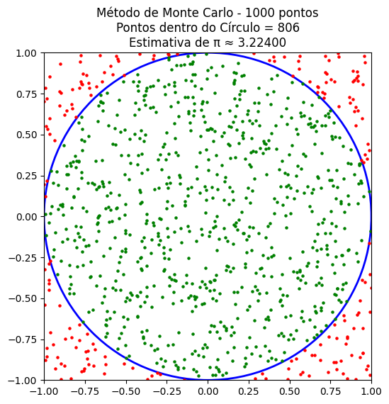
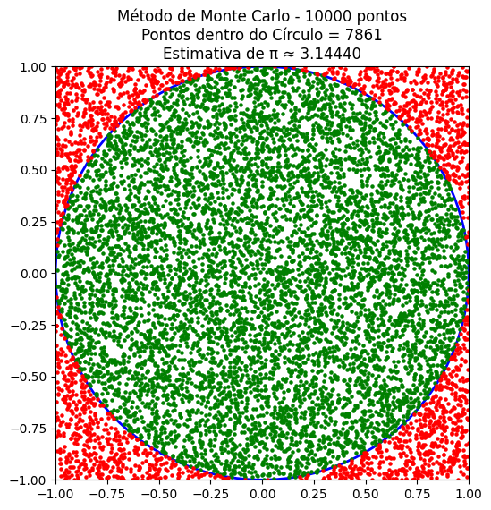
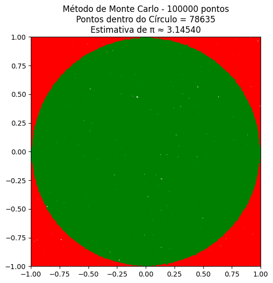

# Programação Concorrente
Trabalho feito por [Hyann Piffer](https://github.com/hyannsp) e [Ingridy Rodrigues](https://github.com/ingridyr) para a disciplina de **Programação Distribuída e Concorrente**.

## 1. Objetivo do Trabalho
Como objetivo do trabalho visamos realizar o **calculo do valor de pi (𝜋)** utilizando python.  
Dividiremos o código em duas partes: A primeira é calculando com programação sequencial e marcando seu tempo, a segunda será calculado o valor utilizando programação concorrente com a biblioteca `concurrent.futures` seguida de uma breve análise com a diferença de tempo.

## 2. Como Calcular o Valor de 𝜋?
Para encontra-lo utilizaremos do **Método do Monte Carlo**, baseado em conceitos probabilísticos.  
Em um contexto hipotético existe um círculo de raio 1 inscrito dentro de um quadrado de lado 2. A área do quadrado é 4 e a do círculo é 𝜋, se gerarmos pontos aleatórios dentro do quadrado, a fração de pontos que caem dentro do círculo deve ser aproximadamente igual à razão das áreas, ou seja: $\frac{Pontos no Circulo}{Total de Pontos} \cong \frac{\Pi}{4}$ e assim multiplicamos o resultado por 4, retornando o valor de pi. Quanto maior a entrada, mais próximo ficamos do valor de PI, por exemplo, nas imagens abaixo criadas por código com a biblioteca `matplotlib` temos a visualização de 1.000 pontos, 10.000 pontos e 100.000 pontos respectivamente.






## 3. Praticando com os Códigos
### 3.1 Aplicação Sequêncial

A função para a aplicação sequêncial é bem simples, criamos uma função `monte_carlo_seq` que receberá a quantidade de pontos que serão usados, esses pontos são gerados aleatóriamente em um range de coordenadas de -1 a 1 na horizontal (eixo X) e -1 a 1 na vertical (eixo Y) , formando um quadrado 2x2 de área igual à 4. Em seguida verificamos se o ponto gerado pertence à área do circulo, onde sua borda é igual à x² + y².

```python
import random
from timeit import default_timer as timer

def monte_carlo_seq(n_points: int) -> tuple[float, float]:
    inside_circle = 0
    start = timer()
    for _ in range(n_points):
        x, y = random.uniform(-1, 1), random.uniform(-1, 1)
        if x**2 + y**2 <= 1:
            inside_circle += 1

    return (inside_circle / n_points) * 4, timer() - start
```